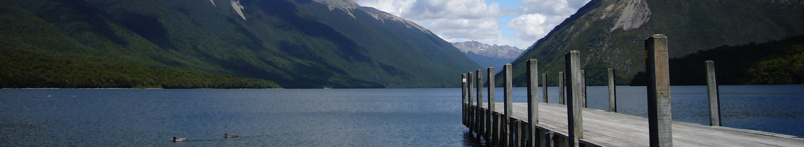
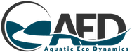

# GLM-AED
[](https://github.com/AquaticEcoDynamics/glm-aed/releases)
[](https://svgshare.com/i/Zhy.svg)
[](https://svgshare.com/i/ZjP.svg)
[](https://svgshare.com/i/ZhY.svg)
[](http://perso.crans.org/besson/LICENSE.html)
[](https://mybinder.org/v2/gh/AquaticEcoDynamics/glm-aed/HEAD?urlpath=rstudio)

<br>

The **General Lake Model** (**GLM**) is a water balance and one-dimensional vertical stratification hydrodynamic model, which is dynamically coupled with the AED water quality modelling library. This repository houses the coupled model code libraries, example applications, and binaries (ready-to-run executable files). 

GLM is suitable for simulating conditions in a wide range of natural and engineered lakes, including shallow (well-mixed) and deep (stratified) systems. The model has been successfully applied to systems from the scale of individual ponds and wetlands, to actively operated reservoirs, upto the scale of the Great Lakes.

<br>

## Repository organisation

The repository includes:

- `binaries` : model pre-compiled executables for mac, linux and windows.
- `glm-source` : model source code, including GLM and AED as linked sub-modules.
- `glm-examples` : model example simulations, including all required input files.
- `workflows` : github workflows for automated compilation and testing.

<br>

## Getting the latest executables

For users who only need access to the model executable download, the executable for your chosen platform can be downloaded without getting the full repository. Simply navigate to the binaries/os folder, click on the relevant file (e.g., glm_3.3.0.zip) and click the "download" button on the right.

<br>

## Citing code

[](https://doi.org/10.5281/zenodo.6363500) (BADGE PENDING RELEASE)

Pending Authors (Pending year). General Lake Model - Aquatic Ecosystem Dynamics (GLM-AED) V XXXX. [Software]. Zenodo. (Pending Zenado DOI)

<br>

## Cloning the repo with all submodule code

A basic clone will not include the code in the submodules so an extra argument is needed `--recurse-submodules`

### Cloning the latest code
```
git clone --recurse-submodules https://github.com/AquaticEcoDynamics/glm-aed.git
```

### Cloning a particular tag
```
git clone --recurse-submodules -b v3.3.0 https://github.com/AquaticEcoDynamics/glm-aed.git
```

<br>

## Archiving all code

If you want to create an archive of all the code (including the submodules), first clone the repository as described above and zip entire repository.  The zip file can be uploaded to Zenado to get a DOI.  An automated integration with Zenodo will not archive the code from the submodules.

<br>

## Additional information

See repository [Wiki](https://github.com/AquaticEcoDynamics/glm-aed/wiki) for additional information on getting started using GLM-AED, working with the repository, and updating or adding new example lakes.

<br>




