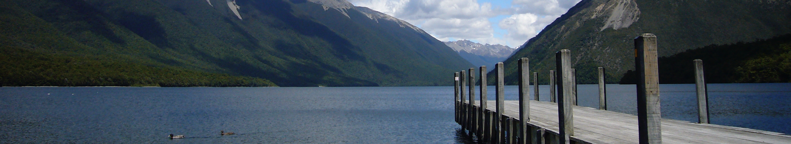

# GLM-AED

[](https://www.repostatus.org/#active)
[](https://github.com/AquaticEcoDynamics/glm-aed/tree/main/binaries)
[](#release-status)
[](binaries/ubuntu)
[](binaries/macos)
[](binaries/windows)
[](LICENSE)
[](https://mybinder.org/v2/gh/AquaticEcoDynamics/glm-aed/HEAD?urlpath=rstudio)

<br>

<a href="url"></a> The **General Lake Model** (**GLM**) is a water balance and one-dimensional vertical stratification hydrodynamic model, which is dynamically coupled with the **AED** water quality modelling library. This repository houses the coupled model code libraries, example applications, and binaries (ready-to-run executable files).

<a href="url"></a> GLM-AED is suitable for simulating conditions in a wide range of natural and engineered lakes, including shallow (well-mixed) and deep (stratified) systems. The model has been successfully applied to systems from the scale of individual ponds and wetlands, to actively operated reservoirs, upto the scale of the Great Lakes.

<br>

## Release status

> [!IMPORTANT]
> **This bundle is current, but in a pre-release state.**
>
> The `main` branch is up to date with the **GLM 4** and **AED 3** source lines, and the
> binaries published here are built from it (currently `glm_4.0.0`). However, there is not yet
> a tagged 4.0.0 release: input configuration, module options and output variables may still
> change before that release is finalised.
>
> The most recent *tagged* release remains
> [`v3.3.0`](https://github.com/AquaticEcoDynamics/glm-aed/releases) (2022), which is built
> against the older GLM 3.x line. If you need a stable, citable version, use that tag and
> expect to revisit your configuration when 4.0.0 is finalised. If you want the current model,
> use the binaries in this repository.

<br>

## Repository organisation

The repository includes:

- `binaries` : model pre-compiled executables for macOS, Linux and Windows.
- `glm-source` : model source code, including GLM and the AED libraries as linked sub-modules.
- `glm-examples` : selected example simulations, including all required input files.
- `.github/workflows` : GitHub Actions workflow (`compile.yml`) for automated compilation and testing.

The source bundle in `glm-source` is assembled from the following sub-modules (dependent repositories):

| Sub-module | Repository | Role |
|---|---|---|
| `GLM` | [`GLM`](https://github.com/AquaticEcoDynamics/GLM) | Hydrodynamic model (4.x line) |
| `libaed-api` | [`libaed-api`](https://github.com/AquaticEcoDynamics/libaed-api) | AED standard coupling interface |
| `libaed-water` | [`libaed-water`](https://github.com/AquaticEcoDynamics/libaed-water) | AED water column modules |
| `libaed-benthic` | [`libaed-benthic`](https://github.com/AquaticEcoDynamics/libaed-benthic) | AED benthic modules |
| `libaed-demo` | [`libaed-demo`](https://github.com/AquaticEcoDynamics/libaed-demo) | AED demonstration modules |
| `libutil` | [`libutil`](https://github.com/AquaticEcoDynamics/libutil) | Shared utility routines |
| `libplot` | [`libplot`](https://github.com/AquaticEcoDynamics/libplot) | Optional plotting support |

<br>

## Getting the latest executables

For users who only need a model executable (not the full source code), it can be downloaded
without cloning the full repository. Navigate to the folder for your platform under `binaries`,
then download the file:

- **macOS** — [`binaries/macos`](binaries/macos), by OS version (`Big_Sur`, `Monterey`, `Sonoma`, `Sequoia`, `Tahoe_26`)
- **Linux** — [`binaries/ubuntu`](binaries/ubuntu), as `.deb` packages by Ubuntu release (`20.04`, `22.04`, `24.04`, `26.04`)
- **Windows** — [`binaries/windows`](binaries/windows), as versioned `.zip` archives

Each platform folder also contains a `glm_latest` directory holding the current build
unpacked, along with a `VERSION` file and a `ReleaseInfo.txt` recording the exact git commits
of every sub-module the build was produced from. If you need to know precisely what source a
binary came from, read `ReleaseInfo.txt`.

<br>

## Cloning the repo with all sub-module code

To access the full repository, including the model examples, the repository must be cloned or
downloaded in full. Note that a basic clone will not include the code/files in the linked
sub-modules, so an extra argument is needed: `--recurse-submodules`

### Cloning the latest code
```
git clone --recurse-submodules https://github.com/AquaticEcoDynamics/glm-aed.git
```

### Cloning a particular tag
```
git clone --recurse-submodules -b v3.3.0 https://github.com/AquaticEcoDynamics/glm-aed.git
```

> [!NOTE]
> This repository is large (over 1 GB) because it carries the full history of published
> binaries. If you only need the current source and examples, a shallow clone is much faster:
> `git clone --depth 1 --recurse-submodules --shallow-submodules https://github.com/AquaticEcoDynamics/glm-aed.git`

<br>

## Version lineage

| Line | Source repository | Status |
|---|---|---|
| **GLM 4.x** | [`GLM`](https://github.com/AquaticEcoDynamics/GLM) | Active development — pre-release |
| GLM 3.x | [`GLM3`](https://github.com/AquaticEcoDynamics/GLM3) | Archived, no longer developed |

Current `glm-aed` builds track the 4.x line and are **not** compatible with the archived
[`GLM3`](https://github.com/AquaticEcoDynamics/GLM3) repository, which uses the earlier AED
coupling interface. To build a 3.x-based coupled model, use a GLM-AED release that predates
the 4.x transition.

<br>

## Citing this code

[](https://zenodo.org/badge/latestdoi/483888457)

Users may need to cite the model in general, or a specific model code package/bundle/version.

Citing a specific code bundle, please use the appropriate DOI, eg.:

*Hipsey, M.R., Boon, C., Bruce, L.C., Thomas, Q., Weber, M., Winslow, L., Read, J.S., & Hamilton, D.P. (2022). AquaticEcoDynamics/glm-aed: v3.3.0 (v3.3.0). Zenodo. https://doi.org/10.5281/zenodo.7047527.*

Note that a DOI for the 4.0.0 bundle will be minted when that release is tagged; until then,
cite the v3.3.0 bundle and state the commit or `ReleaseInfo.txt` build you actually used.

Citing the GLM or AED models:

*Hipsey, M.R., Bruce, L.C., Boon, C., Busch, B., Carey, C.C., Hamilton, D.P., Hanson, P.C., Read, J.S., de Sousa, E., Weber, M. and Winslow, L.A., 2019. A General Lake Model (GLM 3.0) for linking with high-frequency sensor data from the Global Lake Ecological Observatory Network (GLEON). Geoscientific Model Development, 12(1), pp.473-523.*

*Hipsey, M.R., ed. (2022) Modelling Aquatic Eco-Dynamics: Overview of the AED modular simulation platform. Zenodo. https://doi.org/10.5281/zenodo.6516222.*

<br>

## Getting GLM-AED+ (also termed GLM+)

The **AED+** version of AED adds further modules which are within:

- `libaed-dev` — modules under active development,
- `libaed-riparian` — riparian modules,
- `libaed-light` — light and optics modules.

GLM+ is available to members of the AED community.

If you are a researcher or practitioner who would like to work with the AED+ modules, get in
touch with the AED group via
[aquatic.science.uwa.edu.au](https://aquatic.science.uwa.edu.au).

<br>

## Getting hold of older versions

Releases from 2022 onward are available in the
[releases](https://github.com/AquaticEcoDynamics/glm-aed/releases) section, and older binaries
remain in the `binaries` tree. For users seeking older bundles of the code, please visit the
AED [releases](https://github.com/AquaticEcoDynamics/releases) repository.

<br>

## Additional information

See repository [Wiki](https://github.com/AquaticEcoDynamics/glm-aed/wiki) for additional information on getting started using GLM-AED, working with the repository, and updating or adding new example lakes.

For new users, please also visit the [glm-workbook](https://aquaticecodynamics.github.io/glm-workbook/) which contains some practical exercises and case-studies for users new to lake modelling.

<br>

[](https://aquatic.science.uwa.edu.au)
