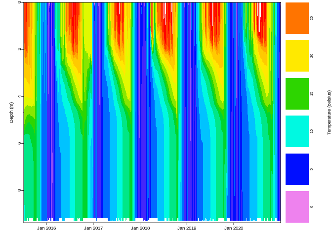
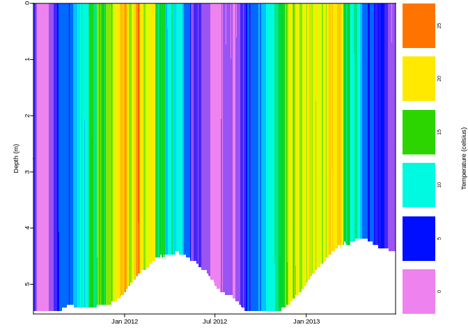
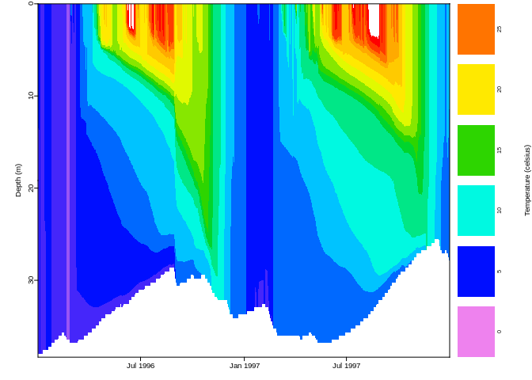
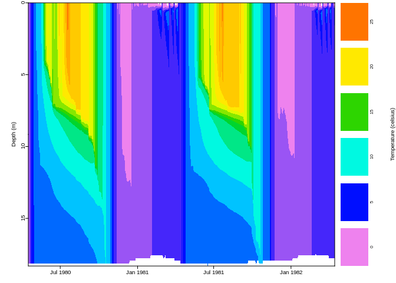
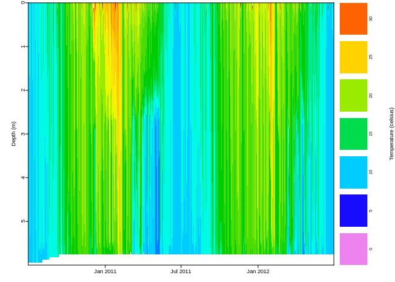

Example Lakes
================
Last compiled on 2022-11-23 04:17:56

If you want to run the simulations, set `do_run = TRUE`.

# Falling Creek Reservoir (FCR)

## Temperature profiles

<!-- -->

# Woods Lake

## Temperature profiles

<!-- -->

# Grosse Dhuenn

## Temperature profiles

<!-- -->

# Sparkling Lake

## Temperature profiles

<!-- -->

# Lake Alexandrina

## Temperature profiles

<!-- -->
