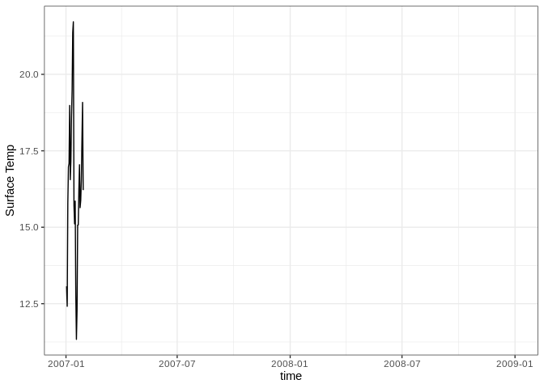

Example Lakes
================

# Set up

If you want to run the simulations within the document, set `do_run =
TRUE`.

``` r
do_run <- FALSE
```

# Example lake 1: Falling Creek Reservior

``` r
lake <- "FCR"
lake_csv <- file.path(base_dir, "glm-examples", lake, "output/lake.csv") 
nc_file <- file.path(base_dir, "glm-examples", lake, "output/output.nc")
run_sim(lake, do_run, base_dir, glm_exec)
```

Lake description:

GLM-AED Configuration description:

## Temperature profiles

<!-- -->

# Example lake 2: Woods Lake

Lake description:

GLM-AED Configuration description:

## Temperature profiles

<!-- -->

# Example lake 3: Ellen Brook

Lake description:

GLM-AED Configuration description:

## Surface temperature

    ## Rows: 732 Columns: 36
    ## ── Column specification ────────────────────────────────────────────────────────
    ## Delimiter: ","
    ## chr  (1): time
    ## dbl (35): Volume, Vol Snow, Vol Blue Ice, Vol White Ice, Tot Inflow Vol, Tot...
    ## 
    ## ℹ Use `spec()` to retrieve the full column specification for this data.
    ## ℹ Specify the column types or set `show_col_types = FALSE` to quiet this message.

    ## Warning: Removed 704 row(s) containing missing values (geom_path).

<!-- -->

# Example lake 4: Grosse Dhuenn

Lake description:

GLM-AED Configuration description:

## Temperature profiles

<!-- -->

# Example lake 5: Sparkling

Lake description:

GLM-AED Configuration description:

## Temperature profiles

<!-- -->
